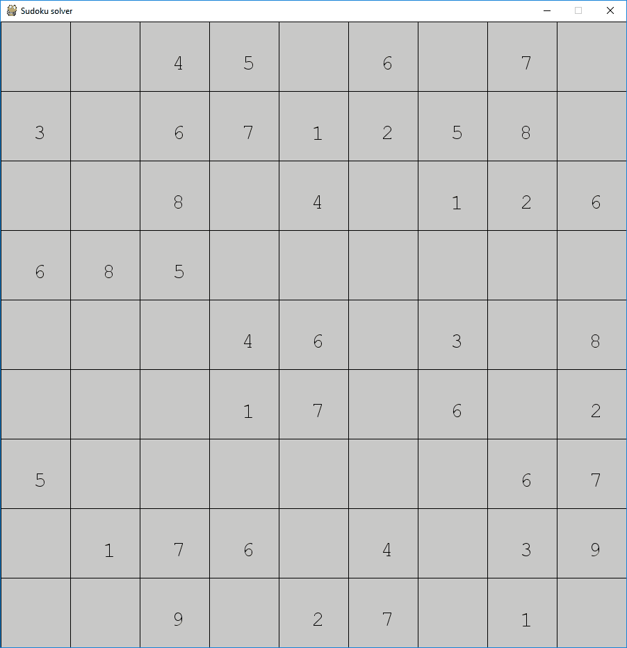

# Sudoku solver visualizer
 A program to visualize solving a sudoku using backtracking.

Requires Python 3+ and Pygame. To run it download the main.py file and run it using the terminal. To change the starting sudoku change the "sudoku" variable.

TO-DO:
I plan on adding the option to input your own sudoku.
